# Design Document: Multilingual Mandi – AI for Bharat

## Overview

The Multilingual Mandi is a web-based AI-powered marketplace platform designed to bridge linguistic barriers in local Indian trade. The system provides real-time price discovery, intelligent negotiation tools, and seamless multilingual communication to empower local vendors and buyers across India's diverse linguistic landscape.

The platform leverages modern AI technologies including natural language processing, machine translation, speech recognition, and intelligent pricing algorithms to create an inclusive digital marketplace that serves users regardless of their preferred language or literacy level.

## Architecture

### High-Level Architecture

```mermaid
graph TB
    subgraph "Client Layer"
        WEB[Web Application]
        PWA[Progressive Web App]
        VOICE[Voice Interface]
    end
    
    subgraph "API Gateway"
        GATEWAY[API Gateway & Load Balancer]
    end
    
    subgraph "Core Services"
        AUTH[Authentication Service]
        USER[User Management Service]
        PRODUCT[Product Catalog Service]
        SEARCH[Search & Discovery Service]
        CHAT[Real-time Communication Service]
        TRANSACTION[Transaction Processing Service]
        NOTIFICATION[Notification Service]
    end
    
    subgraph "AI Services"
        NLP[Natural Language Processing]
        TRANSLATE[Translation Engine]
        SPEECH[Speech-to-Text/Text-to-Speech]
        PRICING[AI Price Discovery]
        RECOMMEND[Recommendation Engine]
        MODERATION[Content Moderation AI]
    end
    
    subgraph "Data Layer"
        USERDB[(User Database)]
        PRODUCTDB[(Product Database)]
        TRANSACTIONDB[(Transaction Database)]
        CACHE[(Redis Cache)]
        SEARCH_INDEX[(Elasticsearch)]
    end
    
    subgraph "External Services"
        PAYMENT[Payment Gateways]
        SMS[SMS Service]
        PUSH[Push Notifications]
    end
    
    WEB --> GATEWAY
    PWA --> GATEWAY
    VOICE --> GATEWAY
    
    GATEWAY --> AUTH
    GATEWAY --> USER
    GATEWAY --> PRODUCT
    GATEWAY --> SEARCH
    GATEWAY --> CHAT
    GATEWAY --> TRANSACTION
    GATEWAY --> NOTIFICATION
    
    AUTH --> USERDB
    USER --> USERDB
    PRODUCT --> PRODUCTDB
    SEARCH --> SEARCH_INDEX
    CHAT --> CACHE
    TRANSACTION --> TRANSACTIONDB
    
    SEARCH --> NLP
    PRODUCT --> TRANSLATE
    CHAT --> TRANSLATE
    VOICE --> SPEECH
    PRODUCT --> PRICING
    SEARCH --> RECOMMEND
    PRODUCT --> MODERATION
    
    TRANSACTION --> PAYMENT
    NOTIFICATION --> SMS
    NOTIFICATION --> PUSH
```



### Technology Stack

**Frontend:**
- React.js with TypeScript for web application
- Progressive Web App (PWA) capabilities for offline support
- Web Speech API for voice interactions
- Responsive design for mobile-first experience

**Backend:**
- Node.js with Express.js for API services
- WebSocket connections for real-time communication
- Microservices architecture for scalability
- Docker containers for deployment

**AI/ML Services:**
- Google Cloud Translation API for multilingual support
- Custom NLP models for Indian language processing
- TensorFlow/PyTorch for recommendation algorithms
- OpenAI GPT models for intelligent price negotiation

**Databases:**
- PostgreSQL for transactional data
- MongoDB for product catalogs and user-generated content
- Redis for caching and session management
- Elasticsearch for search and analytics

**Infrastructure:**
- Cloud deployment (AWS/Google Cloud/Azure)
- CDN for static content delivery
- Load balancers for high availability
- Monitoring and logging systems

## Components and Interfaces

### Core Components

#### 1. Authentication and User Management
- **UserAuthenticator**: Handles registration, login, and session management
- **ProfileManager**: Manages user profiles and preferences
- **LanguageDetector**: Automatically detects user's preferred language
- **AccessibilityManager**: Manages voice interface and accessibility features

#### 2. Multilingual Content Engine
- **ContentTranslator**: Real-time translation of user-generated content
- **LanguageProcessor**: Processes text in multiple Indian languages
- **VoiceProcessor**: Handles speech-to-text and text-to-speech conversion
- **ContentValidator**: Ensures translation quality and cultural appropriateness

#### 3. Product Catalog System
- **ProductManager**: CRUD operations for product listings
- **CategoryManager**: Manages product categories and taxonomies
- **ImageProcessor**: Handles product image upload and optimization
- **InventoryTracker**: Tracks product availability and stock levels

#### 4. AI-Powered Search and Discovery
- **SearchEngine**: Processes natural language search queries
- **RecommendationEngine**: Provides personalized product recommendations
- **QueryProcessor**: Handles multilingual search queries and synonyms
- **ResultRanker**: Ranks search results based on relevance and user preferences

#### 5. Real-time Communication System
- **MessageRouter**: Routes messages between buyers and sellers
- **TranslationService**: Translates messages in real-time
- **VoiceMessageHandler**: Processes voice messages and converts to text
- **ConversationManager**: Manages conversation threads and history

#### 6. AI Price Discovery and Negotiation
- **PriceAnalyzer**: Analyzes market prices and trends
- **NegotiationBot**: AI-powered negotiation assistance
- **MarketIntelligence**: Provides regional market insights
- **PricingRecommender**: Suggests optimal pricing strategies

#### 7. Transaction Processing
- **PaymentProcessor**: Handles payment transactions
- **OrderManager**: Manages order lifecycle
- **DisputeResolver**: Handles transaction disputes
- **ReceiptGenerator**: Generates multilingual receipts and confirmations

### API Interfaces

#### Authentication API
```typescript
interface AuthAPI {
  register(userData: UserRegistration, language: string): Promise<AuthResponse>
  login(credentials: LoginCredentials): Promise<AuthResponse>
  refreshToken(token: string): Promise<TokenResponse>
  logout(userId: string): Promise<void>
}

interface UserRegistration {
  name: string
  phone: string
  email?: string
  preferredLanguage: string
  location: Location
  userType: 'buyer' | 'seller' | 'both'
}
```

#### Product Management API
```typescript
interface ProductAPI {
  createListing(product: ProductListing, sellerId: string): Promise<Product>
  updateListing(productId: string, updates: Partial<ProductListing>): Promise<Product>
  deleteListing(productId: string, sellerId: string): Promise<void>
  getProduct(productId: string, language: string): Promise<Product>
  searchProducts(query: SearchQuery): Promise<SearchResults>
}

interface ProductListing {
  title: string
  description: string
  category: string
  price: number
  currency: string
  images: string[]
  location: Location
  language: string
}
```

#### Communication API
```typescript
interface CommunicationAPI {
  sendMessage(message: Message): Promise<MessageResponse>
  getConversation(conversationId: string, language: string): Promise<Conversation>
  translateMessage(messageId: string, targetLanguage: string): Promise<TranslatedMessage>
  sendVoiceMessage(audioData: Blob, language: string): Promise<VoiceMessageResponse>
}

interface Message {
  senderId: string
  receiverId: string
  content: string
  type: 'text' | 'voice' | 'image'
  language: string
}
```

#### AI Services API
```typescript
interface AIServicesAPI {
  translateText(text: string, sourceLang: string, targetLang: string): Promise<Translation>
  processVoice(audioData: Blob, language: string): Promise<SpeechToTextResponse>
  generateSpeech(text: string, language: string): Promise<TextToSpeechResponse>
  analyzePricing(productData: ProductData, location: Location): Promise<PriceAnalysis>
  getRecommendations(userId: string, context: RecommendationContext): Promise<Recommendation[]>
}
```

## Data Models

### User Model
```typescript
interface User {
  id: string
  name: string
  phone: string
  email?: string
  preferredLanguage: string
  secondaryLanguages: string[]
  location: Location
  userType: 'buyer' | 'seller' | 'both'
  profileImage?: string
  verificationStatus: 'pending' | 'verified' | 'rejected'
  rating: number
  joinDate: Date
  lastActive: Date
  preferences: UserPreferences
}

interface UserPreferences {
  voiceEnabled: boolean
  notificationSettings: NotificationSettings
  privacySettings: PrivacySettings
  accessibilitySettings: AccessibilitySettings
}
```

### Product Model
```typescript
interface Product {
  id: string
  sellerId: string
  title: Record<string, string> // multilingual titles
  description: Record<string, string> // multilingual descriptions
  category: string
  subcategory: string
  price: number
  currency: string
  negotiable: boolean
  images: ProductImage[]
  location: Location
  availability: 'available' | 'sold' | 'reserved'
  condition: 'new' | 'used' | 'refurbished'
  tags: string[]
  createdAt: Date
  updatedAt: Date
  views: number
  favorites: number
  originalLanguage: string
}

interface ProductImage {
  url: string
  alt: Record<string, string> // multilingual alt text
  isPrimary: boolean
}
```

### Transaction Model
```typescript
interface Transaction {
  id: string
  buyerId: string
  sellerId: string
  productId: string
  amount: number
  currency: string
  status: 'pending' | 'confirmed' | 'shipped' | 'delivered' | 'cancelled' | 'disputed'
  paymentMethod: string
  paymentStatus: 'pending' | 'completed' | 'failed' | 'refunded'
  shippingAddress: Address
  negotiationHistory: NegotiationStep[]
  createdAt: Date
  completedAt?: Date
  notes: Record<string, string> // multilingual notes
}

interface NegotiationStep {
  userId: string
  action: 'offer' | 'counter_offer' | 'accept' | 'reject'
  amount: number
  message?: string
  timestamp: Date
}
```

### Conversation Model
```typescript
interface Conversation {
  id: string
  participants: string[]
  productId?: string
  messages: Message[]
  status: 'active' | 'archived' | 'blocked'
  createdAt: Date
  lastMessageAt: Date
}

interface Message {
  id: string
  senderId: string
  content: string
  originalLanguage: string
  translations: Record<string, string>
  type: 'text' | 'voice' | 'image' | 'system'
  timestamp: Date
  readBy: Record<string, Date>
  voiceData?: VoiceData
}

interface VoiceData {
  audioUrl: string
  duration: number
  transcription: Record<string, string>
}
```

## Correctness Properties

*A property is a characteristic or behavior that should hold true across all valid executions of a system—essentially, a formal statement about what the system should do. Properties serve as the bridge between human-readable specifications and machine-verifiable correctness guarantees.*

Before defining the correctness properties, let me analyze the acceptance criteria to determine which ones are testable as properties, examples, or edge cases.

<function_calls>
<invoke name="prework">
<parameter name="featureName">multilingual-mandi

### Property Reflection

After analyzing all acceptance criteria, I've identified several areas where properties can be consolidated to eliminate redundancy:

**Language Display Consolidation**: Properties 1.1, 2.3, 6.3, 7.3, and 8.3 all test that content is displayed in the user's preferred language. These can be combined into a comprehensive language display property.

**Voice Processing Consolidation**: Properties 1.4, 2.5, 3.5, 4.4, 5.5, and 7.1-7.5 all relate to voice interface functionality. These can be consolidated into core voice processing properties.

**Translation Consistency**: Properties 2.2, 4.2, and 4.3 all relate to translation functionality and can be combined into comprehensive translation properties.

**Error Handling Consolidation**: Properties 1.5, 4.5, and 7.4 all deal with error handling and can be combined into general error handling properties.

**AI Processing Consolidation**: Properties 3.1, 3.2, 6.1, 6.2, 8.1, and 9.1 all involve AI processing and can be consolidated into core AI functionality properties.

Based on this analysis, the following properties provide unique validation value without redundancy:

### Core Correctness Properties

**Property 1: Language Interface Consistency**
*For any* user with a preferred regional language, all platform interfaces should display content in that user's preferred language
**Validates: Requirements 1.1, 2.3, 6.3, 7.3, 8.3**

**Property 2: Secure Data Handling**
*For any* valid user registration or authentication data, the system should properly validate, securely store, and authenticate the information
**Validates: Requirements 1.2, 1.3**

**Property 3: Multilingual Content Translation**
*For any* content created in a source language, the system should generate accurate translations for all supported regional languages and preserve both original and translated versions
**Validates: Requirements 2.2, 4.2, 4.3**

**Property 4: Voice Processing Round Trip**
*For any* voice input in a supported regional language, converting speech to text and back to speech should preserve the semantic meaning
**Validates: Requirements 1.4, 2.5, 3.5, 4.4, 5.5, 7.1, 7.2, 7.3**

**Property 5: Intelligent Search Processing**
*For any* search query in a regional language, the system should process context, synonyms, and regional variations to return relevant results ranked by user preferences
**Validates: Requirements 3.1, 3.2, 3.3, 3.4**

**Property 6: Communication Interface Provision**
*For any* conversation initiation between users, the system should provide appropriate messaging interfaces with translation capabilities
**Validates: Requirements 4.1**

**Property 7: Transaction Language Consistency**
*For any* transaction between users with different preferred languages, all transaction details, receipts, and confirmations should be displayed in each user's preferred language
**Validates: Requirements 5.1, 5.3**

**Property 8: Payment Integration Reliability**
*For any* valid payment attempt, the system should successfully integrate with appropriate local payment systems and process the transaction
**Validates: Requirements 5.2**

**Property 9: Dispute Resolution Multilingual Support**
*For any* transaction dispute between users with different preferred languages, the mediation tools should support communication in both users' languages
**Validates: Requirements 5.4**

**Property 10: AI Recommendation Adaptation**
*For any* user behavior change or preference update, the recommendation engine should adapt suggestions to reflect regional preferences and cultural context
**Validates: Requirements 6.1, 6.2, 6.4, 6.5**

**Property 11: Voice Error Recovery**
*For any* voice recognition failure or background noise interference, the system should provide appropriate fallback options and confirmation prompts
**Validates: Requirements 7.4, 7.5**

**Property 12: Market Intelligence Provision**
*For any* seller request for market data, the system should provide regional pricing analysis and trend information in the seller's preferred language
**Validates: Requirements 8.1, 8.2, 8.4, 8.5**

**Property 13: Content Moderation Effectiveness**
*For any* submitted content, the system should scan for policy violations and apply appropriate moderation actions with clear multilingual notifications
**Validates: Requirements 9.1, 9.2, 9.4, 9.5**

**Property 14: Multilingual Reporting Interface**
*For any* user report or issue submission, the system should provide reporting mechanisms in all supported regional languages
**Validates: Requirements 9.3**

**Property 15: Offline Synchronization Consistency**
*For any* offline action performed when connectivity is lost, the system should queue the action and synchronize it properly when connectivity is restored, handling conflicts appropriately
**Validates: Requirements 10.1, 10.2, 10.3, 10.5**

**Property 16: Connectivity Requirement Indication**
*For any* critical action that requires internet connectivity, the system should clearly indicate online requirements when attempted in offline mode
**Validates: Requirements 10.4**

**Property 17: Error Message Localization**
*For any* system error or failure, error messages should be displayed in the user's preferred regional language with clear explanations
**Validates: Requirements 1.5, 4.5**

## Error Handling

### Error Categories and Responses

**Language Processing Errors:**
- Translation failures: Fallback to original language with notification
- Voice recognition errors: Request clarification or provide text input option
- Unsupported language detection: Offer closest supported language alternative

**Network and Connectivity Errors:**
- API timeouts: Retry with exponential backoff
- Offline mode: Cache critical data and queue actions for sync
- Payment gateway failures: Provide alternative payment methods

**Data Validation Errors:**
- Invalid user input: Clear error messages in user's preferred language
- Content moderation flags: Explain policy violations and provide correction guidance
- File upload errors: Specify format requirements and size limits

**System Integration Errors:**
- Third-party service failures: Graceful degradation with user notification
- Database connection issues: Use cached data when possible
- Authentication service errors: Provide alternative login methods

### Error Recovery Strategies

**Automatic Recovery:**
- Retry failed API calls with exponential backoff
- Automatically sync queued offline actions when connectivity returns
- Re-attempt failed translations with alternative translation services

**User-Assisted Recovery:**
- Provide clear error messages with suggested actions
- Offer alternative input methods when primary method fails
- Allow manual conflict resolution for data synchronization issues

**Graceful Degradation:**
- Disable non-essential features during system stress
- Use cached data when real-time data is unavailable
- Provide basic functionality even when AI services are down

## Testing Strategy

### Dual Testing Approach

The testing strategy employs both unit testing and property-based testing to ensure comprehensive coverage:

**Unit Tests:**
- Focus on specific examples, edge cases, and error conditions
- Test integration points between components
- Validate specific user scenarios and workflows
- Test error handling and boundary conditions

**Property-Based Tests:**
- Verify universal properties across all inputs through randomization
- Test system behavior with generated data sets
- Validate correctness properties defined in this design document
- Ensure system reliability across diverse input combinations

### Property-Based Testing Configuration

**Testing Framework:** 
- Use fast-check for JavaScript/TypeScript property-based testing
- Configure each property test to run minimum 100 iterations
- Tag each test with references to design document properties

**Test Tagging Format:**
```javascript
// Feature: multilingual-mandi, Property 1: Language Interface Consistency
```

**Property Test Implementation:**
- Each correctness property must be implemented as a single property-based test
- Tests should generate random valid inputs within the property's domain
- Assertions should verify the universal quantification statement holds

### Testing Coverage Areas

**Multilingual Functionality:**
- Language detection and interface adaptation
- Translation accuracy and consistency
- Voice processing in multiple languages
- Cultural sensitivity in content handling

**AI Service Integration:**
- Search query processing and result ranking
- Recommendation engine accuracy
- Price discovery and market analysis
- Content moderation effectiveness

**Real-time Communication:**
- Message translation and preservation
- Voice message processing
- Conversation management
- Error handling and fallback mechanisms

**Transaction Processing:**
- Payment integration with local systems
- Receipt generation in multiple languages
- Dispute resolution workflows
- Security and data protection

**Offline Capabilities:**
- Data caching and synchronization
- Conflict resolution mechanisms
- Connectivity requirement indication
- Queue management for offline actions

### Performance and Load Testing

**Scalability Testing:**
- Test system performance under high user loads
- Validate AI service response times under stress
- Test database performance with large datasets
- Verify CDN effectiveness for global users

**Language Processing Performance:**
- Measure translation service response times
- Test voice processing latency
- Validate search performance across languages
- Monitor AI recommendation generation speed

**Mobile and Connectivity Testing:**
- Test PWA functionality across devices
- Validate offline mode performance
- Test synchronization efficiency
- Verify voice interface on mobile devices